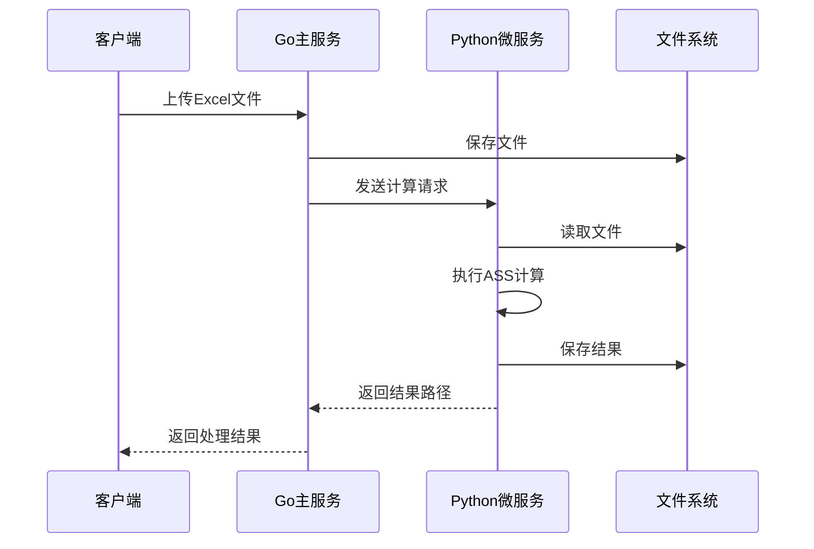
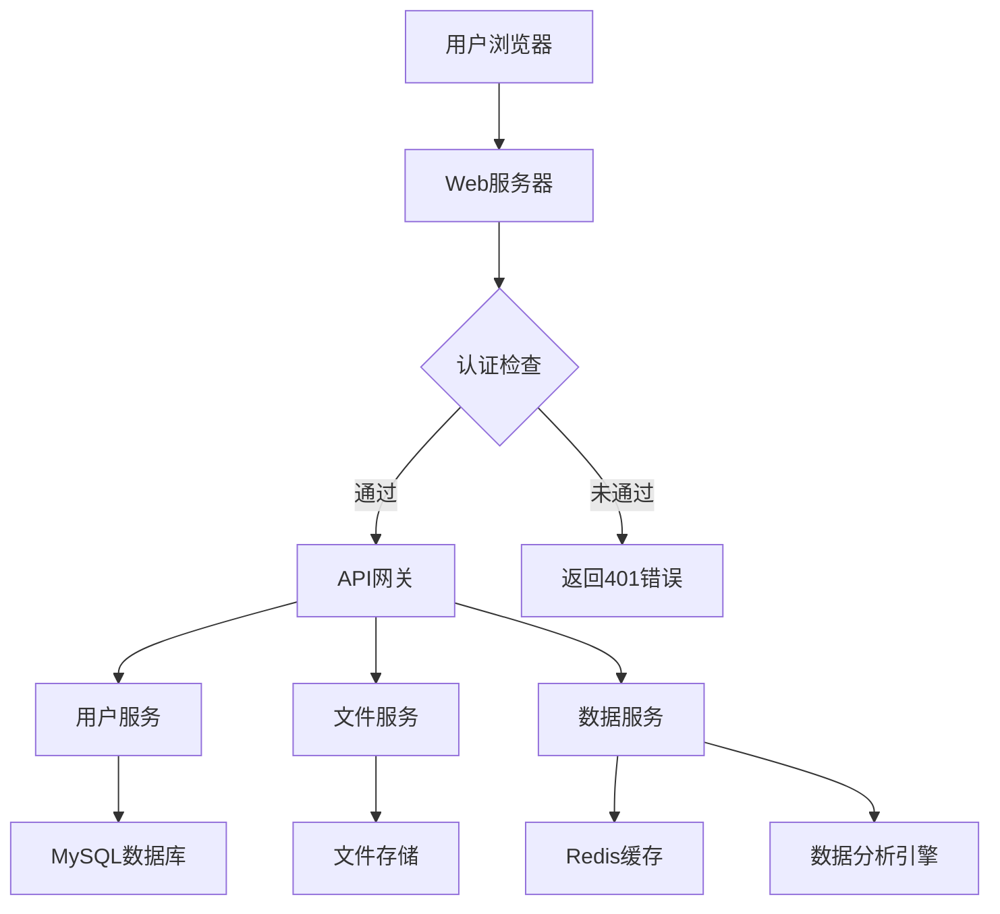
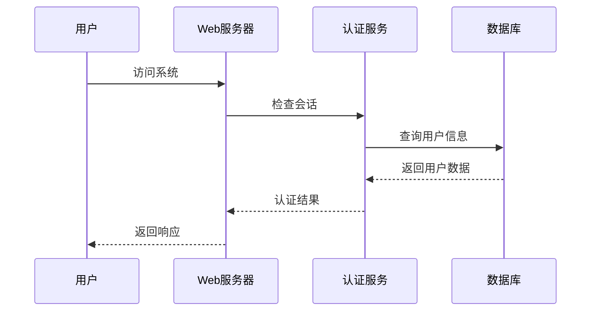
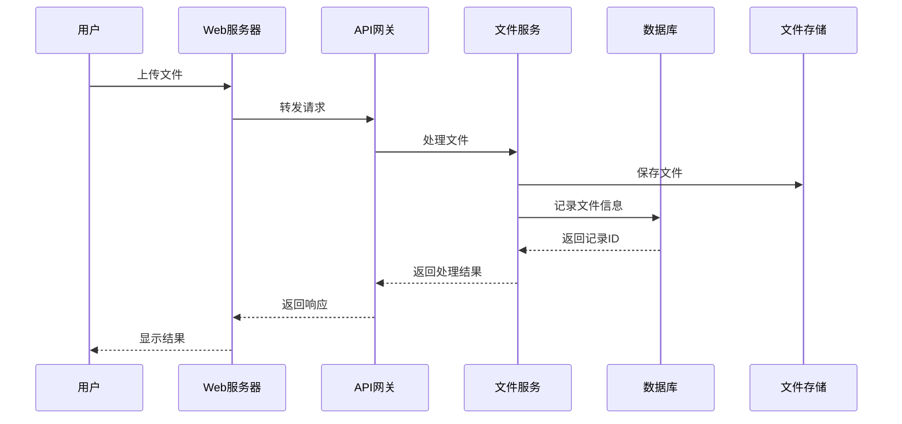
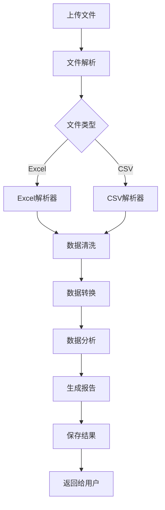

# AI大模型数据综合处理系统 (ALMDCPS)

> AI Large Model Data Comprehensive Processing System

## 项目概述

ALMDCPS 是一个基于 Go 语言和 Gin 框架开发的企业级数据处理系统。该系统集成了用户管理、数据处理、文件管理等多个模块，旨在为企业提供高效、安全、可靠的数据处理解决方案。

### 核心特性

- **用户管理系统**：完整的用户认证和授权机制
- **文件处理引擎**：支持多种格式文件的批量处理
- **数据分析平台**：提供数据可视化和分析功能
- **实时进度监控**：处理过程实时反馈
- **安全性保障**：数据加密存储，访问权限控制

## 技术架构

### 后端技术栈
- **框架**：Gin Web Framework
- **数据库**：MySQL
- **缓存**：Redis（可选）
- **会话管理**：Gin-Sessions
- **文件处理**：自研引擎

### 前端技术栈
- **框架**：原生 JavaScript
- **UI 框架**：Bootstrap 5
- **HTTP 客户端**：Fetch API
- **样式处理**：CSS3

## 功能模块

### 1. 用户管理系统
- **用户认证**
  - 账号密码登录
  - 会话管理
  - 权限控制
- **用户信息**
  - 个人资料管理
  - 密码修改
  - 操作日志

### 2. 文件处理系统
- **文件上传**
  - 支持多种文件格式
  - 文件大小限制
  - 类型验证
- **大模型处理**
  - AI 智能处理流程
  - 自然语言理解
  - 智能分析结果
- **进度监控**
  - 实时进度显示
  - 状态查询
  - 错误提示
- **文件自动清理**
  - 定时清理过期文件（24小时后）
  - 每小时自动检查
  - 清理日志记录

### 3. 数据分析平台
- **文件重命名工具**
  - 批量重命名
  - 自定义规则
  - 操作日志
- **相似度分析服务**
  - **ASS (AI Semantic Similarity) 计算**
    - 基于深度学习的语义相似度计算
    - 使用预训练模型：yangjhchs/acge_text_embedding
    - 支持批量Excel文件处理
    - 计算原理：
      1. 文本向量化：使用BERT模型将文本转换为高维向量
      2. 余弦相似度：计算两个文本向量之间的余弦相似度
      3. 结果范围：0-1之间，1表示完全相似，0表示完全不相似
    - 使用场景：
      - 答案相似度评估
      - 文本语义匹配
      - 智能问答系统
  - **ACC (Accurate Character Comparison) 计算**
    - 精确字符匹配
    - 支持批量处理
    - 二值化结果：1（完全相同）或 0（存在差异）
- **数据可视化**（开发中）
  - 数据可视化
  - 报表生成
  - 趋势分析

### 4. Python 微服务
- **语义相似度服务**
  - 端口：5000
  - 依赖：
    - Flask：Web服务框架
    - sentence-transformers：文本向量化
    - numpy：数值计算
  - API接口：
    - POST /calculate-ass：计算语义相似度
    - 输入：Excel文件（.xlsx格式）
      - A列：标准答案文本
      - B列：预测文本
    - 输出：
      - 状态：success/error
      - 消息：处理结果说明
      - 结果文件：包含原文本和相似度分数的Excel文件
        - A列：标准答案文本
        - B列：预测文本
        - C列：ASS分数（0-1之间的浮点数）
  - 计算过程：
    1. 文本预处理：
       - 去除首尾空白字符
       - 转换为字符串格式
    2. 向量化：
       - 使用预训练的BERT模型生成文本嵌入向量
       - 向量维度：768维
    3. 相似度计算：
       - 使用余弦相似度公式：cos(θ) = (A·B)/(||A||·||B||)
       - A和B为两个文本的向量表示
       - 结果归一化到0-1范围
  - 使用示例：
    ```python
    import requests
    
    url = 'http://localhost:5000/calculate-ass'
    files = {'file': open('input.xlsx', 'rb')}
    response = requests.post(url, files=files)
    
    if response.status_code == 200:
        result = response.json()
        print(f"结果文件：{result['resultFile']}")
    ```

## 微服务架构实现

### 1. 架构概述

本系统采用微服务架构，将核心功能拆分为独立的服务：

- **Go 主服务**：负责用户认证、文件管理和 ACC 计算
- **Python AI 微服务**：专注于 ASS（AI语义相似度）计算
- **共享文件系统**：用于服务间的文件交换

### 2. 服务通信流程



### 3. 服务实现细节

#### 3.1 Go 主服务
- **路由处理**：
  ```go
  router.POST("/api/calculate-ass", handlers.CalculateASS)
  router.POST("/api/calculate-acc", handlers.CalculateACC)
  ```
- **文件处理**：
  - 支持 Excel 文件上传
  - 文件格式验证
  - 临时文件管理

#### 3.2 Python 微服务
- **API 端点**：
  ```python
  @app.route('/calculate-ass', methods=['POST'])
  def calculate_ass():
      # 处理文件上传
      # 执行向量计算
      # 返回结果
  ```
- **AI 模型集成**：
  - 使用 sentence-transformers
  - 模型：yangjhchs/acge_text_embedding
  - 向量维度：768

### 4. 服务间通信

#### 4.1 请求格式
- **ASS 计算请求**：
  ```json
  POST http://localhost:5000/calculate-ass
  Content-Type: multipart/form-data
  
  {
    "file": "(binary)"
  }
  ```

#### 4.2 响应格式
- **成功响应**：
  ```json
  {
    "status": "success",
    "message": "计算完成",
    "resultFile": "/uploads/result_xxx.xlsx"
  }
  ```
- **错误响应**：
  ```json
  {
    "status": "error",
    "message": "处理失败",
    "error": "详细错误信息"
  }
  ```

### 5. 错误处理机制

#### 5.1 服务级别错误
- 服务不可用
- 请求超时
- 资源不足

#### 5.2 业务级别错误
- 文件格式错误
- 计算失败
- 参数无效

### 6. 监控和日志

#### 6.1 服务监控
- 服务健康检查
- 性能指标收集
- 资源使用监控

#### 6.2 日志记录
- 请求日志
- 错误日志
- 性能日志

### 7. 部署配置

#### 7.1 环境变量
```bash
# Go 服务
GO_PORT=8081
UPLOAD_DIR=./uploads

# Python 服务
PYTHON_PORT=5000
MODEL_PATH=./models
```

#### 7.2 依赖管理
- **Go 依赖**：
  ```go
  // go.mod
  require (
      github.com/gin-gonic/gin v1.7.4
      github.com/360EntSecGroup-Skylar/excelize/v2 v2.4.0
  )
  ```
- **Python 依赖**：
  ```text
  # requirements.txt
  flask==2.0.1
  sentence-transformers==2.2.2
  numpy==1.21.2
  pandas==1.3.3
  ```

### 8. 优势和挑战

#### 8.1 优势
- 服务解耦
- 技术栈灵活
- 独立扩展
- 故障隔离

#### 8.2 挑战
- 服务协调
- 数据一致性
- 部署复杂性
- 监控需求

### 9. 未来改进

#### 9.1 短期计划
- 服务注册与发现
- 负载均衡
- 熔断机制

#### 9.2 长期计划
- 容器化部署
- 服务网格
- 自动扩缩容

## 系统配置

### 文件管理配置
- **上传目录**: `./uploads`
- **文件清理配置**:
  - 文件最大保存时间：24小时
  - 清理检查间隔：1小时
  - 清理日志：系统日志中记录所有清理操作

### 运行环境要求
- **操作系统**：Windows/Linux/MacOS
- **Go 版本**：1.17+
- **MySQL 版本**：8.0+
- **Redis 版本**：6.2+（可选）

## 项目结构

```
ALMDCPS/
├── api/          # API 接口定义
├── config/       # 配置文件
├── models/       # 数据模型
├── utils/        # 工具函数
│   └── cleanup.go # 文件清理工具
├── web/          # 前端资源
│   ├── css/      # 样式文件
│   ├── js/       # JavaScript 文件
│   └── images/   # 图片资源
├── gongju/       # 工具集
└── main.go       # 主程序入口
```

## 系统架构图



## 详细系统流程

### 1. 用户认证流程



### 2. 文件处理流程



### 3. 数据分析流程



## 数据库设计

### 用户表 (users)
| 字段名       | 类型         | 说明               |
|--------------|--------------|--------------------|
| id           | BIGINT       | 主键，自增         |
| username     | VARCHAR(50)  | 用户名，唯一       |
| password     | VARCHAR(255) | 加密后的密码       |
| email        | VARCHAR(100) | 邮箱，唯一         |
| created_at   | DATETIME     | 创建时间           |
| updated_at   | DATETIME     | 最后更新时间       |
| status       | TINYINT      | 用户状态（0/1）    |

### 文件表 (files)
| 字段名       | 类型         | 说明               |
|--------------|--------------|--------------------|
| id           | BIGINT       | 主键，自增         |
| user_id      | BIGINT       | 用户ID             |
| file_name    | VARCHAR(255) | 文件名             |
| file_path    | VARCHAR(255) | 文件存储路径       |
| file_size    | BIGINT       | 文件大小（字节）   |
| status       | TINYINT      | 文件状态（0/1/2）  |
| created_at   | DATETIME     | 创建时间           |
| updated_at   | DATETIME     | 最后更新时间       |

### 操作日志表 (operation_logs)
| 字段名       | 类型         | 说明               |
|--------------|--------------|--------------------|
| id           | BIGINT       | 主键，自增         |
| user_id      | BIGINT       | 用户ID             |
| operation    | VARCHAR(50)  | 操作类型           |
| detail       | TEXT         | 操作详情           |
| created_at   | DATETIME     | 创建时间           |

## API 接口文档

### 1. 用户认证接口

#### 登录接口
- **URL**: /api/v1/login
- **Method**: POST
- **Request**:
  ```json
  {
    "username": "testuser",
    "password": "test123"
  }
  ```
- **Response**:
  ```json
  {
    "code": 200,
    "data": {
      "token": "eyJhbGciOiJIUzI1NiIsInR5cCI6IkpXVCJ9...",
      "user_info": {
        "id": 1,
        "username": "testuser"
      }
    }
  }
  ```

#### 注册接口
- **URL**: /api/v1/register
- **Method**: POST
- **Request**:
  ```json
  {
    "username": "newuser",
    "password": "newpass123",
    "email": "newuser@example.com"
  }
  ```
- **Response**:
  ```json
  {
    "code": 200,
    "data": {
      "id": 2,
      "username": "newuser"
    }
  }
  ```

### 2. 文件处理接口

#### 文件上传接口
- **URL**: /api/v1/upload
- **Method**: POST
- **Request**:
  - Content-Type: multipart/form-data
  - Form Data:
    - file: 要上传的文件
- **Response**:
  ```json
  {
    "code": 200,
    "data": {
      "file_id": 123,
      "file_name": "example.xlsx",
      "status": "uploaded"
    }
  }
  ```

#### 文件处理状态查询
- **URL**: /api/v1/files/{file_id}/status
- **Method**: GET
- **Response**:
  ```json
  {
    "code": 200,
    "data": {
      "file_id": 123,
      "status": "processing",
      "progress": 75
    }
  }
  ```

## 详细环境配置指南

### 1. Go 环境配置
```bash
# 安装 Go
brew install go

# 设置环境变量
echo 'export GOPATH=$HOME/go' >> ~/.zshrc
echo 'export PATH=$PATH:$GOPATH/bin' >> ~/.zshrc
source ~/.zshrc

# 验证安装
go version
```

### 2. MySQL 配置
```bash
# 安装 MySQL
brew install mysql

# 启动 MySQL 服务
brew services start mysql

# 创建数据库
mysql -u root -p
CREATE DATABASE almdps CHARACTER SET utf8mb4 COLLATE utf8mb4_unicode_ci;
GRANT ALL PRIVILEGES ON almdps.* TO 'almdps_user'@'localhost' IDENTIFIED BY 'your_password';
FLUSH PRIVILEGES;

#创建数据库
CREATE TABLE IF NOT EXISTS users (
    id INT AUTO_INCREMENT PRIMARY KEY,
    username VARCHAR(50) NOT NULL UNIQUE,
    password VARCHAR(255) NOT NULL,
    created_at TIMESTAMP DEFAULT CURRENT_TIMESTAMP,
    updated_at TIMESTAMP DEFAULT CURRENT_TIMESTAMP ON UPDATE CURRENT_TIMESTAMP
);

```

### 3. Redis 配置（可选）
```bash
# 安装 Redis
brew install redis

# 启动 Redis 服务
brew services start redis
```

### 4. 项目配置
```bash
# 克隆项目
git clone https://github.com/your-repo/ALMDCPS.git
cd ALMDCPS

# 安装依赖
go mod download

# 配置环境变量
cp .env.example .env
# 编辑 .env 文件配置数据库连接等信息
```

## 开发规范

### 1. 代码风格
- 遵循 Go 官方代码风格指南
- 使用 gofmt 格式化代码
- 变量命名采用 camelCase
- 常量命名采用 UPPER_CASE
- 接口命名以 'er' 结尾

### 2. 提交规范
- 提交信息格式：[类型] 简短描述
  - 类型包括：feat, fix, docs, style, refactor, test, chore
  - 示例：[feat] 添加用户登录功能
- 提交前必须通过所有测试
- 提交前必须格式化代码

### 3. 测试规范
- 单元测试覆盖率不低于 80%
- 每个功能模块必须有对应的测试用例
- 使用 table-driven tests 编写测试
- 测试数据使用 test fixtures

### 4. 文档规范
- 每个包必须有 package 注释
- 每个导出函数必须有函数注释
- 复杂逻辑必须有代码注释
- 使用 godoc 生成文档

## 错误处理机制

### 1. 错误分类
- 系统错误（500）：服务器内部错误
- 客户端错误（400）：请求参数错误
- 认证错误（401）：未授权访问
- 权限错误（403）：禁止访问
- 资源错误（404）：资源不存在

### 2. 错误返回格式
```json
{
  "code": 400,
  "message": "Invalid request parameters",
  "details": {
    "username": "username is required"
  }
}
```

### 3. 日志记录
- 使用 zap 日志库
- 日志级别：debug, info, warn, error, fatal
- 日志格式：JSON
- 日志文件按天分割
- 敏感信息脱敏处理

## 性能优化建议

### 1. 数据库优化
- 添加必要的索引
- 使用连接池
- 避免 N+1 查询
- 使用 EXPLAIN 分析慢查询

### 2. 缓存优化
- 使用 Redis 缓存热点数据
- 设置合理的缓存过期时间
- 使用缓存穿透保护机制

### 3. 并发处理
- 使用 goroutine 处理耗时操作
- 使用 sync.Pool 重用对象
- 使用 context 控制超时

### 4. 前端优化
- 使用 CDN 加速静态资源
- 启用 Gzip 压缩
- 使用 HTTP/2
- 优化图片资源

## 安全策略

### 1. 认证安全
- 使用 JWT 认证
- 密码使用 bcrypt 加密
- 设置合理的会话过期时间
- 实现防暴力破解机制

### 2. 数据安全
- 敏感数据加密存储
- 使用 HTTPS 传输数据
- 实现 CSRF 防护
- 使用 CSP 安全策略

### 3. 输入验证
- 所有输入参数必须验证
- 使用正则表达式验证格式
- 防止 SQL 注入
- 防止 XSS 攻击

### 4. 日志安全
- 不记录敏感信息
- 日志文件权限控制
- 日志文件定期归档
- 实现日志审计功能

## 快速开始

1. **克隆项目**
   ```bash
   git clone https://github.com/your-repo/ALMDCPS.git
   cd ALMDCPS
   ```

2. **安装依赖**
   ```bash
   go mod download
   ```

3. **配置数据库**
   - 创建数据库
   - 修改 config/database.go 配置

4. **启动服务**
   ```bash
   go run main.go
   ```

5. **访问系统**
   - 打开浏览器访问：http://localhost:8081

## 使用指南

### 用户登录
1. 访问系统首页
2. 点击"登录"按钮
3. 输入用户名和密码
4. 提交登录请求

### 文件处理
1. 登录系统
2. 选择要处理的文件
3. 上传文件
4. 等待处理完成
5. 下载处理结果

## 开发计划

### 当前版本 (v1.6)
- [x] 用户认证系统
- [x] 文件上传功能
- [x] 文件重命名工具
- [ ] 数据分析平台

### 下一版本 (v1.7)
- [ ] 数据可视化功能
- [ ] 批量处理优化
- [ ] 用户权限管理
- [ ] 性能优化

## 技术支持

如遇到问题，请联系：
- 邮箱：youanchi@foxmail.com

## 许可说明

版权所有 2025 youanchi
保留所有权利

# ALMDCPS - 智能大模型分值计算系统

## 项目简介
ALMDCPS（AI Large Model Data Processing System）是一个基于人工智能的文本相似度计算系统。该系统能够对输入的文本对进行智能分析，计算它们之间的相似度分数，并提供直观的结果展示。

## 功能特点
1. **文本相似度计算**
   - F1分数计算
   - ACC分数计算
   - ASS分数计算（基于深度学习模型）

2. **批量处理能力**
   - 支持Excel文件批量上传
   - 自动处理多行文本数据
   - 生成带有计算结果的新Excel文件

3. **用户友好界面**
   - 简洁的Web操作界面
   - 实时处理进度显示
   - 错误提示和处理

## 系统要求
- Python 3.9+
- 依赖包：
  ```
  sentence-transformers==2.2.2
  openpyxl==3.1.2
  numpy==1.24.3
  torch>=2.0.0
  transformers>=4.30.0
  tqdm>=4.65.0
  scikit-learn>=1.2.2
  huggingface-hub==0.16.4
  flask==2.3.3
  flask-cors==4.0.0
  ```

## 安装说明
1. 克隆项目到本地
2. 创建并激活Python虚拟环境：
   ```bash
   python -m venv venv
   source venv/bin/activate  # Linux/Mac
   # 或
   venv\Scripts\activate  # Windows
   ```
3. 安装依赖：
   ```bash
   pip install -r requirements.txt
   ```

## 使用说明

### 启动服务
1. 进入python_service_v1.1目录
2. 运行服务：
   ```bash
   python ASS.py
   ```
   服务将在 http://localhost:5001 启动

### Excel文件格式要求
1. 文件格式：.xlsx
2. 数据格式：
   - A列：标准答案文本
   - B列：预测文本
   - 第一行为表头

### 使用步骤
1. 打开Web界面
2. 选择要处理的Excel文件
3. 点击相应的计算按钮（F1/ACC/ASS）
4. 等待处理完成，系统会自动下载结果文件

### 结果文件说明
- 生成新的Excel文件，包含：
  - 原始的标准答案（A列）
  - 原始的预测文本（B列）
  - 计算的相似度分数（C列）

## 错误处理
1. 文件格式错误：确保上传.xlsx格式的Excel文件
2. 数据为空：确保Excel文件中至少包含一行有效数据
3. 列数不足：确保Excel文件至少包含两列数据
4. 网络错误：检查网络连接和服务器状态

## 技术架构
1. **前端**：
   - HTML5
   - Bootstrap
   - JavaScript

2. **后端**：
   - Flask Web服务
   - Sentence Transformers模型
   - Excel处理（openpyxl）

3. **AI模型**：
   - 使用预训练的文本嵌入模型
   - 支持中文文本处理
   - 高效的相似度计算

## 注意事项
1. 服务启动时会加载AI模型，可能需要一定时间
2. 处理大文件时可能需要较长时间，请耐心等待
3. 建议每次处理的Excel文件不超过1000行
4. 确保系统有足够的内存来运行AI模型

## 更新日志
### v1.6
- 添加了ASS分数计算功能
- 优化了文件处理逻辑
- 改进了错误处理机制
- 添加了详细的日志记录
- 优化了用户界面响应
