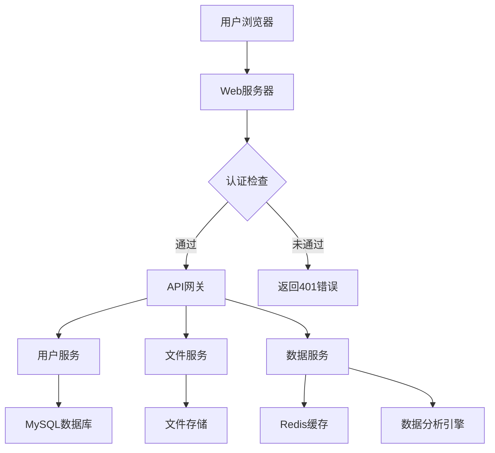
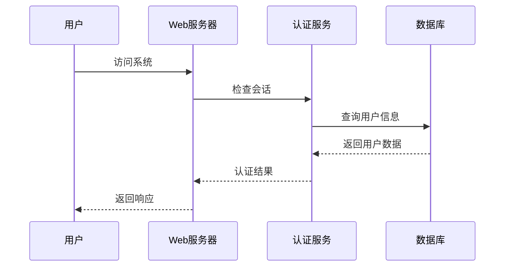
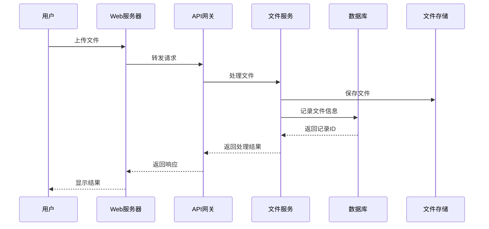
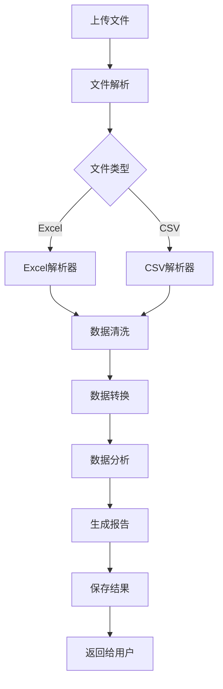

# AI大模型数据综合处理系统 (ALMDCPS)

> AI Large Model Data Comprehensive Processing System

## 项目概述

ALMDCPS 是一个基于 Go 语言和 Gin 框架开发的企业级数据处理系统。该系统集成了用户管理、数据处理、文件管理等多个模块，旨在为企业提供高效、安全、可靠的数据处理解决方案。

### 核心特性

- **用户管理系统**：完整的用户认证和授权机制
- **文件处理引擎**：支持多种格式文件的批量处理
- **数据分析平台**：提供数据可视化和分析功能
- **实时进度监控**：处理过程实时反馈
- **安全性保障**：数据加密存储，访问权限控制

## 技术架构

### 后端技术栈
- **框架**：Gin Web Framework
- **数据库**：MySQL
- **缓存**：Redis（可选）
- **会话管理**：Gin-Sessions
- **文件处理**：自研引擎

### 前端技术栈
- **框架**：原生 JavaScript
- **UI 框架**：Bootstrap 5
- **HTTP 客户端**：Fetch API
- **样式处理**：CSS3

## 功能模块

### 1. 用户管理系统
- **用户认证**
  - 账号密码登录
  - 会话管理
  - 权限控制
- **用户信息**
  - 个人资料管理
  - 密码修改
  - 操作日志

### 2. 文件处理系统
- **文件上传**
  - 支持多种文件格式
  - 文件大小限制
  - 类型验证
- **大模型处理**
  - AI 智能处理流程
  - 自然语言理解
  - 智能分析结果
- **进度监控**
  - 实时进度显示
  - 状态查询
  - 错误提示

### 3. 数据分析平台
- **文件重命名工具**
  - 批量重命名
  - 自定义规则
  - 操作日志
- **数据分析服务**（开发中）
  - 数据可视化
  - 报表生成
  - 趋势分析

## 项目结构

```
ALMDCPS/
├── api/          # API 接口定义
├── config/       # 配置文件
├── models/       # 数据模型
├── utils/        # 工具函数
├── web/          # 前端资源
│   ├── css/      # 样式文件
│   ├── js/       # JavaScript 文件
│   └── images/   # 图片资源
├── chengshi/     # 工具集
└── main.go       # 主程序入口
```

## 系统架构图



## 详细系统流程

### 1. 用户认证流程



### 2. 文件处理流程



### 3. 数据分析流程



## 数据库设计

### 用户表 (users)
| 字段名       | 类型         | 说明               |
|--------------|--------------|--------------------|
| id           | BIGINT       | 主键，自增         |
| username     | VARCHAR(50)  | 用户名，唯一       |
| password     | VARCHAR(255) | 加密后的密码       |
| email        | VARCHAR(100) | 邮箱，唯一         |
| created_at   | DATETIME     | 创建时间           |
| updated_at   | DATETIME     | 最后更新时间       |
| status       | TINYINT      | 用户状态（0/1）    |

### 文件表 (files)
| 字段名       | 类型         | 说明               |
|--------------|--------------|--------------------|
| id           | BIGINT       | 主键，自增         |
| user_id      | BIGINT       | 用户ID             |
| file_name    | VARCHAR(255) | 文件名             |
| file_path    | VARCHAR(255) | 文件存储路径       |
| file_size    | BIGINT       | 文件大小（字节）   |
| status       | TINYINT      | 文件状态（0/1/2）  |
| created_at   | DATETIME     | 创建时间           |
| updated_at   | DATETIME     | 最后更新时间       |

### 操作日志表 (operation_logs)
| 字段名       | 类型         | 说明               |
|--------------|--------------|--------------------|
| id           | BIGINT       | 主键，自增         |
| user_id      | BIGINT       | 用户ID             |
| operation    | VARCHAR(50)  | 操作类型           |
| detail       | TEXT         | 操作详情           |
| created_at   | DATETIME     | 创建时间           |

## API 接口文档

### 1. 用户认证接口

#### 登录接口
- **URL**: /api/v1/login
- **Method**: POST
- **Request**:
  ```json
  {
    "username": "testuser",
    "password": "test123"
  }
  ```
- **Response**:
  ```json
  {
    "code": 200,
    "data": {
      "token": "eyJhbGciOiJIUzI1NiIsInR5cCI6IkpXVCJ9...",
      "user_info": {
        "id": 1,
        "username": "testuser"
      }
    }
  }
  ```

#### 注册接口
- **URL**: /api/v1/register
- **Method**: POST
- **Request**:
  ```json
  {
    "username": "newuser",
    "password": "newpass123",
    "email": "newuser@example.com"
  }
  ```
- **Response**:
  ```json
  {
    "code": 200,
    "data": {
      "id": 2,
      "username": "newuser"
    }
  }
  ```

### 2. 文件处理接口

#### 文件上传接口
- **URL**: /api/v1/upload
- **Method**: POST
- **Request**:
  - Content-Type: multipart/form-data
  - Form Data:
    - file: 要上传的文件
- **Response**:
  ```json
  {
    "code": 200,
    "data": {
      "file_id": 123,
      "file_name": "example.xlsx",
      "status": "uploaded"
    }
  }
  ```

#### 文件处理状态查询
- **URL**: /api/v1/files/{file_id}/status
- **Method**: GET
- **Response**:
  ```json
  {
    "code": 200,
    "data": {
      "file_id": 123,
      "status": "processing",
      "progress": 75
    }
  }
  ```

## 详细环境配置指南

### 1. Go 环境配置
```bash
# 安装 Go
brew install go

# 设置环境变量
echo 'export GOPATH=$HOME/go' >> ~/.zshrc
echo 'export PATH=$PATH:$GOPATH/bin' >> ~/.zshrc
source ~/.zshrc

# 验证安装
go version
```

### 2. MySQL 配置
```bash
# 安装 MySQL
brew install mysql

# 启动 MySQL 服务
brew services start mysql

# 创建数据库
mysql -u root -p
CREATE DATABASE almdps CHARACTER SET utf8mb4 COLLATE utf8mb4_unicode_ci;
GRANT ALL PRIVILEGES ON almdps.* TO 'almdps_user'@'localhost' IDENTIFIED BY 'your_password';
FLUSH PRIVILEGES;
```

### 3. Redis 配置（可选）
```bash
# 安装 Redis
brew install redis

# 启动 Redis 服务
brew services start redis
```

### 4. 项目配置
```bash
# 克隆项目
git clone https://github.com/your-repo/ALMDCPS.git
cd ALMDCPS

# 安装依赖
go mod download

# 配置环境变量
cp .env.example .env
# 编辑 .env 文件配置数据库连接等信息
```

## 开发规范

### 1. 代码风格
- 遵循 Go 官方代码风格指南
- 使用 gofmt 格式化代码
- 变量命名采用 camelCase
- 常量命名采用 UPPER_CASE
- 接口命名以 'er' 结尾

### 2. 提交规范
- 提交信息格式：[类型] 简短描述
  - 类型包括：feat, fix, docs, style, refactor, test, chore
  - 示例：[feat] 添加用户登录功能
- 提交前必须通过所有测试
- 提交前必须格式化代码

### 3. 测试规范
- 单元测试覆盖率不低于 80%
- 每个功能模块必须有对应的测试用例
- 使用 table-driven tests 编写测试
- 测试数据使用 test fixtures

### 4. 文档规范
- 每个包必须有 package 注释
- 每个导出函数必须有函数注释
- 复杂逻辑必须有代码注释
- 使用 godoc 生成文档

## 错误处理机制

### 1. 错误分类
- 系统错误（500）：服务器内部错误
- 客户端错误（400）：请求参数错误
- 认证错误（401）：未授权访问
- 权限错误（403）：禁止访问
- 资源错误（404）：资源不存在

### 2. 错误返回格式
```json
{
  "code": 400,
  "message": "Invalid request parameters",
  "details": {
    "username": "username is required"
  }
}
```

### 3. 日志记录
- 使用 zap 日志库
- 日志级别：debug, info, warn, error, fatal
- 日志格式：JSON
- 日志文件按天分割
- 敏感信息脱敏处理

## 性能优化建议

### 1. 数据库优化
- 添加必要的索引
- 使用连接池
- 避免 N+1 查询
- 使用 EXPLAIN 分析慢查询

### 2. 缓存优化
- 使用 Redis 缓存热点数据
- 设置合理的缓存过期时间
- 使用缓存穿透保护机制

### 3. 并发处理
- 使用 goroutine 处理耗时操作
- 使用 sync.Pool 重用对象
- 使用 context 控制超时

### 4. 前端优化
- 使用 CDN 加速静态资源
- 启用 Gzip 压缩
- 使用 HTTP/2
- 优化图片资源

## 安全策略

### 1. 认证安全
- 使用 JWT 认证
- 密码使用 bcrypt 加密
- 设置合理的会话过期时间
- 实现防暴力破解机制

### 2. 数据安全
- 敏感数据加密存储
- 使用 HTTPS 传输数据
- 实现 CSRF 防护
- 使用 CSP 安全策略

### 3. 输入验证
- 所有输入参数必须验证
- 使用正则表达式验证格式
- 防止 SQL 注入
- 防止 XSS 攻击

### 4. 日志安全
- 不记录敏感信息
- 日志文件权限控制
- 日志文件定期归档
- 实现日志审计功能

## 快速开始

1. **克隆项目**
   ```bash
   git clone https://github.com/your-repo/ALMDCPS.git
   cd ALMDCPS
   ```

2. **安装依赖**
   ```bash
   go mod download
   ```

3. **配置数据库**
   - 创建数据库
   - 修改 config/database.go 配置

4. **启动服务**
   ```bash
   go run main.go
   ```

5. **访问系统**
   - 打开浏览器访问：http://localhost:8081

## 使用指南

### 用户登录
1. 访问系统首页
2. 点击"登录"按钮
3. 输入用户名和密码
4. 提交登录请求

### 文件处理
1. 登录系统
2. 选择要处理的文件
3. 上传文件
4. 等待处理完成
5. 下载处理结果

## 开发计划

### 当前版本 (v1.2)
- [x] 用户认证系统
- [x] 文件上传功能
- [x] 文件重命名工具
- [ ] 数据分析平台

### 下一版本 (v1.3)
- [ ] 数据可视化功能
- [ ] 批量处理优化
- [ ] 用户权限管理
- [ ] 性能优化

## 技术支持

如遇到问题，请联系：
- 邮箱：youanchi@foxmail.com


## 许可说明

版权所有 2025 youanchi
保留所有权利
